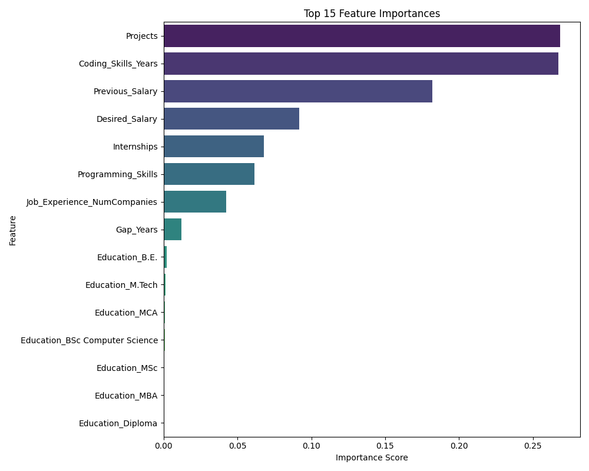
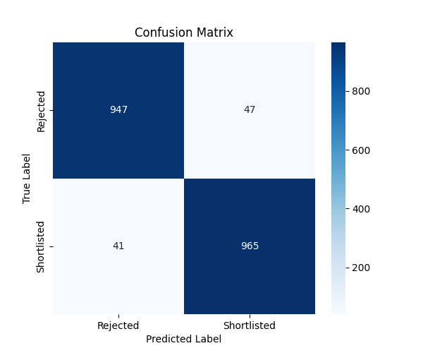
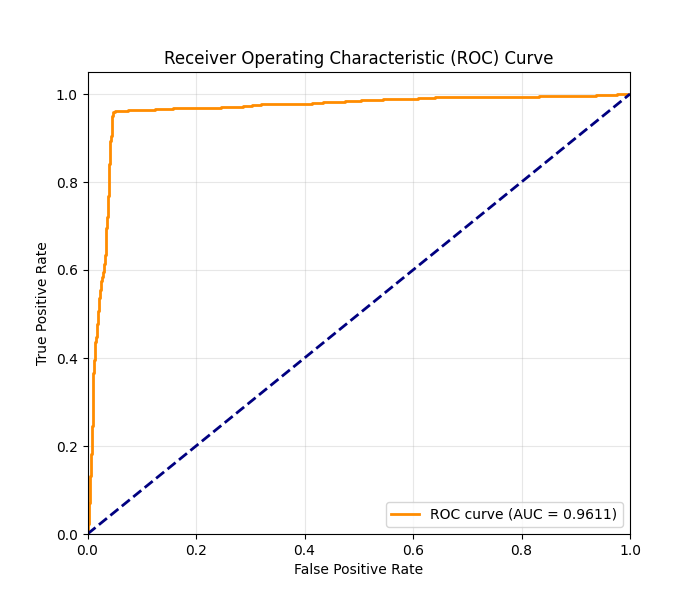

# AI Resume Screener: Smart Classification and Shortlisting System
A Python ML project using NLP and a Tkinter GUI to parse PDF resumes and predict candidate shortlisting.

This project is an end-to-end application designed to automate the initial job screening process. It uses a Machine Learning model to classify candidate resumes as **"Shortlisted"** or **"Rejected"** based on a predefined set of criteria.

The application features a simple **drag-and-drop GUI** built with Tkinter. A recruiter can drop multiple PDF resumes into the app, which then parses them, extracts key features, and generates a final Excel report with the predictions.


---

## Features

* **Drag-and-Drop GUI:** Simple and intuitive interface built with Tkinter and `tkinterdnd2`.
* **PDF & OCR Parsing:** Reads text from native PDFs (`fitz`) and uses OCR (`pytesseract`) for scanned or image-based resumes.
* **NLP Feature Extraction:** Uses a custom-built NLP pipeline (spaCy and Regex) to extract specific, model-ready features (e.g., years of experience, salary, education).
* **ML Model:** Predicts candidate suitability using a `RandomForestClassifier` trained on a custom dataset, achieving **96% accuracy**.
* **Batch Processing:** Analyzes multiple resumes at once.
* **Excel Report:** Exports a detailed report (`Resume_Results.xlsx`) containing all extracted data and the final prediction for each candidate.

---

## Technologies Used

This project combines several Python libraries to create a full-stack ML application:

* **Machine Learning & Data:** scikit-learn, pandas, numpy
* **NLP & PDF Processing:** spaCy, PyMuPDF (fitz), pytesseract, regex
* **GUI:** Tkinter, tkinterdnd2
* **Plotting:** Matplotlib, Seaborn

---

## Installation & Setup

1.  **Clone the repository:**
    ```bash
    git clone [https://github.com/Kushal-Choudhary758/Job-Screening-Classification.git] (https://github.com/Kushal-Choudhary758/Job-Screening-Classification.git)
    cd Job-Screening-Classification
    ```

2.  **Install Python libraries:**
    Create a `requirements.txt` file with the contents below and run `pip install -r requirements.txt`.

    **`requirements.txt`:**
    ```
    pandas
    numpy
    scikit-learn
    spacy
    PyMuPDF
    pytesseract
    Pillow
    matplotlib
    seaborn
    tkinterdnd2
    ```

3.  **Install Google Tesseract-OCR:**
    `pytesseract` is a Python wrapper for Google's Tesseract-OCR engine. You must install the engine itself on your system.
    * **Windows:** Download the installer from the [official Tesseract repository](https://github.com/tesseract-ocr/tesseract).
    * **Mac:** `brew install tesseract`
    * **Linux:** `sudo apt-get install tesseract-ocr`

4.  **Download spaCy Model:**
    The project uses a small spaCy model for NLP tasks.
    ```bash
    python -m spacy download en_core_web_sm
    ```

---

## How to Run

The project is structured within a Jupyter Notebook (`Test.ipynb`) for a clear, step-by-step execution flow.

1.  **Place your dataset** (`Resume_Dataset.csv`) in the same directory.
2.  **Open `Test.ipynb`** in Jupyter Notebook or VS Code.
3.  **Run the cells sequentially from top to bottom:**
    * **Block 1:** Imports all libraries.
    * **Block 2:** Loads `Resume_Dataset.csv` and trains the Random Forest model. This must be run to create the `best_model` in memory.
    * **Block 3 & 4:** Generates the performance plots and saves them to the disk.
    * **Block 5:** Defines all the PDF parsing and NLP functions.
    * **Block 6:** **This cell launches the GUI.**

4.  **Using the Application:**
    * Once Block 6 is run, the "AI Resume Analyzer" window will appear.
    * Drag and drop your PDF resumes onto the "Drop PDFs Here" area.
    * Click the **"Start Analysis"** button.
    * The progress bar will update, and when complete, an Excel file named `Resume_Results.xlsx` will be created in your directory and opened automatically.

---

## Model Performance & Evaluation

The Random Forest model was trained on the `Resume_Dataset.csv` and evaluated on a 20% test split. The model demonstrates high performance with an **accuracy of 95.6% (rounded to 96%)**.

### Feature Importances

As expected, `Desired_Salary` and `Previous_Salary` are the most significant predictors, followed by `Coding_Skills_Years` and `Programming_Skills`.



### Confusion Matrix

The model is highly balanced, correctly identifying both "Rejected" and "Shortlisted" candidates with high precision and recall.



### ROC Curve

The model shows a high Area Under the Curve (AUC) of 0.96, indicating a strong ability to distinguish between the two classes.



---

## Project Context

This project was developed as part of the MCA 3rd Semester curriculum for the **MCAC-18 Minor Project**, fulfilling the course learning objectives for AI/ML model design, implementation, and evaluation.
